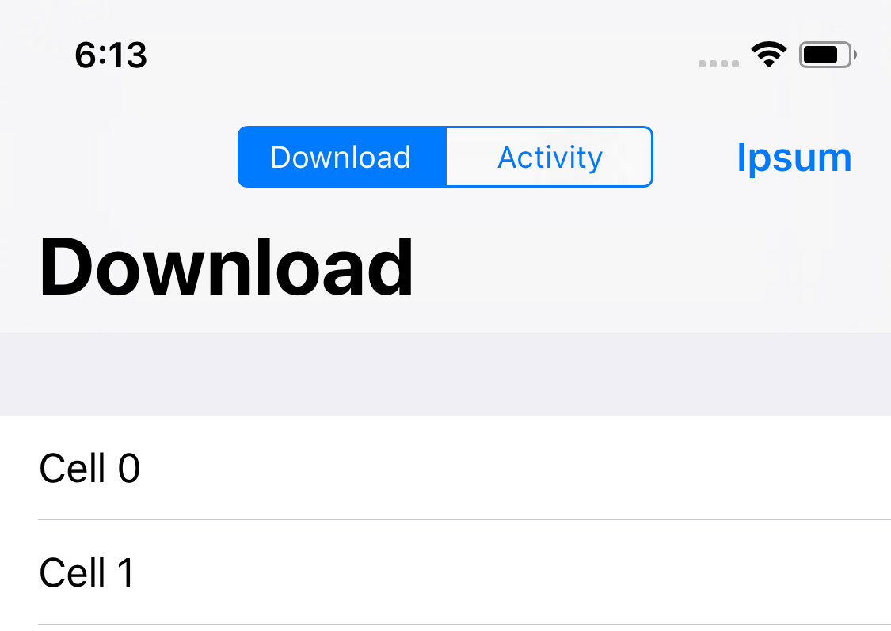

# TOSegmentedSplitViewController

*I'm shelving this project for the time being, but feel free to play with the same app and let me if you think it has potential.*

This library is a view controller subclass designed for apps that are controlled primarily by a `UITabBarController`. The idea is that 2 view controllers that shouldn't necessarily have their own separate tabs are merged into a sort of 'sub-tab' where they can then easily be accessed by a segmented control running along the top. It's also possible to swipe between the two with a built in scroll view.

On iPad devices, the view controllers are displayed concurrently, next to each other.

I decided to stop developing this because I hit some design issues I wasn't exactly happy with.

* Suppressing the title in favor of the segmented control in the navigation bar felt like bad UX.
* It ended up being really hacky having to force `UINavigationController` to hide the titles.
* Swiping between the controllers felt cool, but getting the segmented control to behave nicely with content passing under it was tricky.

In the end, I think I was over-complicating this. In most cases, separate tabs would probably just make more logical sense.

In any case, I'm leaving it here in case anyone wants to play with it. Enjoy! :)